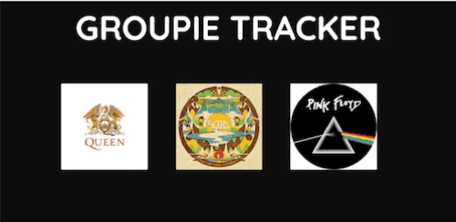

# Groupie-Tracker

Groupie Trackers is a web project aimed at manipulating and displaying data from a given API to create an interactive and user-friendly website showcasing information about various bands and artists. The project involves working with an API structured into four parts:


1. **Artists**: Contains details about bands and artists, including their names, images, the year they began their activity, the release date of their first album, and their members.

2. **Locations**: Provides information on the locations of their recent and upcoming concerts.

3. **Dates**: Lists the dates of their recent and upcoming concerts.

4. **Relation**: Links the information from the artists, dates, and locations parts.



## Features

-   Display comprehensive band and artist profiles.
-   Show concert locations and dates in an organized manner.
-   Enable user interactions that trigger server requests and dynamically update the content.
-   Utilise various visualisation techniques to enhance the user experience.


## Getting Started

To get started with the project, ensure you have the necessary environment set up for Go development. Follow these steps:

1.  Clone the repository.
2.  Set up the Go environment and dependencies. ``` go mod tidy ```
	
3.  Run the server ``` go run main.go``` and access the site through your browser at http://localhost:8080/.


## Technical Requirements

-   Backend development in Go.
- Frontend development in HTML/CSS and Go templates
-   Implement error handling and ensure the site is crash-free.